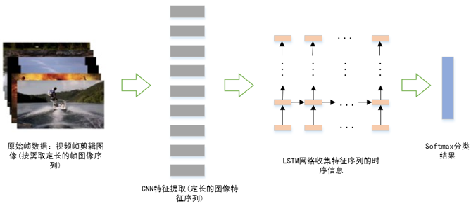

# Action_recognition #
This is an implementation of action recognition algorithm based on scene. The algorithm utilizes the *Inception v3* model and the *LSTM* model and is implemented using the **tensorflow** platform. This algorithm is suitable for video containing individual actions.  
The overall process of the algorithm is as follows:  

